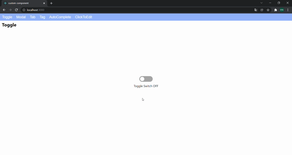
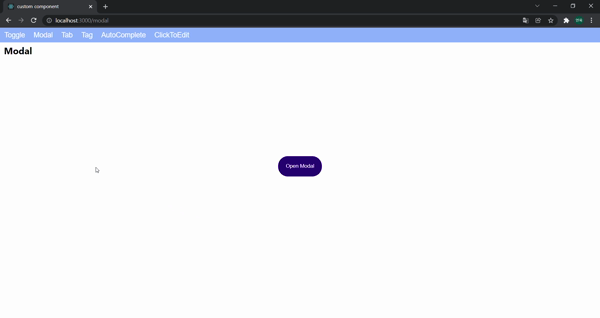
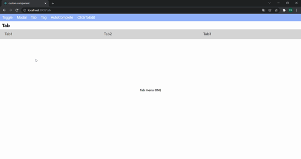
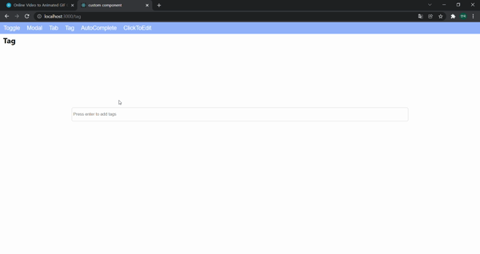
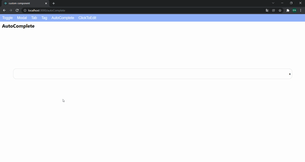
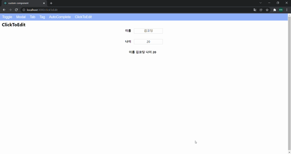

# wanted_pre_onboarding

## 실행 방법

```
npm start
```

실행 후 상단에 있는 header에서 각 기능을 선택해 실행할 수 있습니다.

## 구현 기능

### Toggle.js



구현 방법

> label로 toggle의 크기를 지정하고
> 
> 크기가 0인 checkbox를 붙여 사용자의 체크 여부를 확인합니다.
> 
> span으로 체크 되었을 때와 아닐 때의 시각적 효과를 주어 완성합니다.

이유

> 선택과 비선택의 이벤트만 발생하기 때문에 checkbox를 사용했습니다.

### Modal.js



구현 방법

> modal을 여는 button을 포함한 부모 컴포넌트의 자식 컴포넌트로 modal을 만들고 import합니다.
> 
> 부모 컴포넌트에 boolean state를 두어 modal의 렌더링 여부를 결정합니다.

이유

> 필요한 곳에서 import해 사용할 수 있게 자식 컴포넌트로 구현했습니다.

### Tab.js



구현 방법

> 각각의 tab을 button으로 구현해 click 시 tab 번호를 넘겨줍니다.
> 
> 갱신된 tab 번호를 하단에서 보여줍니다.

이유

> onClick 이벤트를 이용해 하단에 보여줄 state값을 갱신하기 위해 button으로 구현했습니다.

### Tag.js



구현 방법

> tag와 input을 감싸는 Tag-body div를 만들고
> 
> input으로 입력받은 tag들을 array state에 저장해 map으로 보여줍니다.
> 
> 각각의 tag에 고유한 id값을 부여해 삭제 처리 합니다.

이유

> display: flex로 input창 앞에 추가되는 tag가 차례대로 쌓이도록 구현했습니다.

### AutoComplete.js



구현 방법

> 선택지로 주어질 데이터를 array로 저장해둡니다.
> 
> input에 입력된 value와 데이터 array를 비교해 
> 
> value가 포함된 결과만 result array에 담아 보여줍니다.
> 
> 선택된 요소로 value값을 갱신합니다.

이유

> 보유한 데이터와 사용자의 입력값을 비교해 
> 
> 포함된 결과만 보여주도록 구현했습니다.

### ClickToEdit.js



구현 방법

> 각각의 칸에 focus를 두었는지 저장할 state들을 두고
> 
> focus를 둔 경우에 수정이 가능한 input으로 렌더링합니다.

이유

> 처음에는 input의 readonly 처리를 시도했는데,
> 
> 글씨가 아닌 input 내부를 클릭해도 수정 가능한 상태로 바뀌어서
> 
> 구분을 주기 위해 div와 input이 state에 따라 렌더링되도록 구현했습니다.
